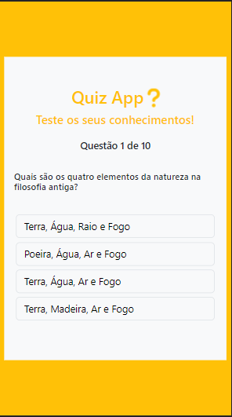

# To-Do-List

## Quiz-App.

 

Status: Concluído. Sujeito à atualizações.

 

Pré-requisito: Navegador atualizado.

 
## Sumário

- [Sobre](#Sobre)
- [Como Jogar](#Como-jogar)
- [Linguagens e Recursos Usados](#Linguagens-e-Recursos-Usados)
- [Links](#Links)
- [Autor](#Autor)

## Sobre

Projeto de aplicação de um jogo de perguntas e respostas que exibe o resultado final após responder as questões.

#### Desktop 

#### Mobile 

## Como Jogar

Para começar a jogar, clique no botão iniciar.

#### Desktop 

#### Mobile 

Dada a pergunta, clique sobre a alternativa desejada.

#### Desktop 

#### Mobile 

Se a resposta for correta, a opção escolhida ficará verde e passará para a próxima pergunta. Caso a resposta for errada, a opção escolhida ficará vermelha e a opção correta será revelada com a cor verde.

#### Desktop 

#### Mobile 

### Resultado

Depois das 10 perguntas respondidas, você verá o resultado e logo abaixo verá o botão para Reiniciar o jogo.

#### Desktop 

#### Mobile 

Ao reiniciar o jogo, as perguntas poderão ter uma ordem diferente e não ser as mesmas da rodada anterior.

## Linguagens e Recursos Usados
- HTML5
- CSS3
- JavaScript
- Bootstrap

## Links

- URL do Projeto: [Click here](https://github.com/DouglasReis98/Quiz-App)
- URL da Página: [Click here](https://douglasreis98.github.io/quiz-app/)

## Autor
- Website - [Douglas Reis](http://douglasreis.epizy.com)
- Frontend Mentor - [@DouglasReis98](https://www.frontendmentor.io/profile/DouglasReis98)
- LinkedIn - [@douglas-reis98](https://www.linkedin.com/in/douglas-reis98/)